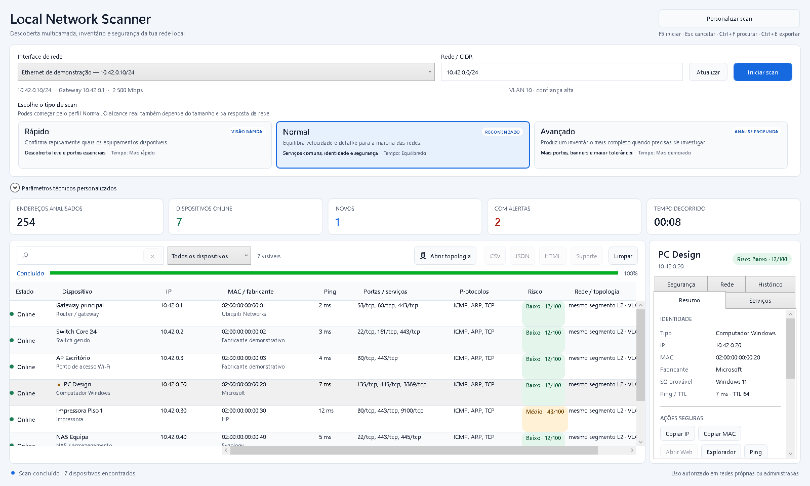
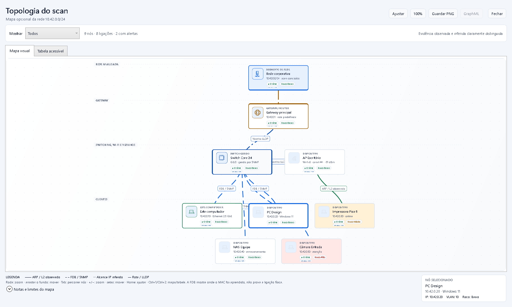

<!-- Copyright (c) 2026 p-darksy-r and Local Network Scanner. Licensed under the MIT License. -->

# Local Network Scanner

[](https://github.com/p-darksy-r/LocalNetworkScanner/blob/main/CHANGELOG.md)

[](https://github.com/p-darksy-r/LocalNetworkScanner/blob/main/LICENSE)

[CI](https://github.com/p-darksy-r/LocalNetworkScanner/actions/workflows/ci.yml) · [Releases](https://github.com/p-darksy-r/LocalNetworkScanner/releases) · [Instalação](https://github.com/p-darksy-r/LocalNetworkScanner/blob/main/docs/INSTALLATION.md) · [Limites técnicos](https://github.com/p-darksy-r/LocalNetworkScanner/blob/main/docs/TECHNICAL_LIMITS.md)

Scanner de redes locais para Windows com uma UI WPF simples, uma CLI para automação, diagnósticos acionáveis e topologia opcional. O programa separa observações diretas, dados fornecidos pela infraestrutura e inferências, para que um resultado provável nunca seja apresentado como facto confirmado.

> **[Descarregar a release publicada mais recente](https://github.com/p-darksy-r/LocalNetworkScanner/releases/latest)**
>
> O repositório é privado: a página e os ficheiros da release exigem uma conta GitHub com acesso. O `main` contém o candidato 1.3.0; uma tag/release nova só deve ser criada depois dos gates de assinatura e redistribuição indicados abaixo.





_Imagens geradas com dados sintéticos; não expõem endereços nem identificadores de uma rede real._

## Escolher o download

Cada release disponibiliza uma versão para computadores x64 e outra para Windows ARM64:

| Formato | Ficheiro | Quando usar |
| --- | --- | --- |
| **Instalador** | `LocalNetworkScanner-<versão>-<arquitetura>-setup.exe` | instalação por utilizador, entrada no menu Iniciar, desinstalador e atalho opcional |
| **Portátil** | `LocalNetworkScanner-<versão>-<arquitetura>.zip` | execução sem instalação; extraia primeiro o ZIP e abra `LocalNetworkScanner.exe` |

Os dois formatos incluem a UI, a CLI e o runtime .NET necessário. O instalador não pede privilégios administrativos no fluxo normal, não instala drivers ou serviços e não altera o `PATH`.

### Compatibilidade e validação

| Alvo | Estado |
| --- | --- |
| Windows 11 x64 | candidato 1.3.0 gerado; build, 55 testes e smoke do executável x64 concluídos |
| Windows 11 ARM64 | candidato 1.3.0 gerado por cross-build; validação em hardware ARM64 nativo ainda pendente |
| Windows 10 | o .NET 10 limita o suporte atual a edições LTSC/Enterprise compatíveis; consulte a [matriz oficial da Microsoft](https://learn.microsoft.com/dotnet/core/install/windows#supported-versions) |

Os executáveis são self-contained, mas não são NativeAOT. Algumas bibliotecas internas podem ser extraídas temporariamente pelo runtime quando a aplicação arranca.

### Aviso de assinatura

Os executáveis e instaladores da versão atual estão **sem assinatura Authenticode (`NotSigned`)**. O Microsoft Defender SmartScreen pode apresentar um aviso de reputação e o Smart App Control ou uma política empresarial pode bloquear completamente o arranque com o código `4551`. Antes de executar:

1. descarregue apenas a partir da [release oficial](https://github.com/p-darksy-r/LocalNetworkScanner/releases/latest);
2. compare o SHA-256 com `SHA256SUMS.txt` ou com o ficheiro `.sha256` adjacente;
3. não execute o ficheiro se o hash for diferente.

```powershell
$file = '.\LocalNetworkScanner-<versão>-win-x64.zip'
(Get-FileHash -LiteralPath $file -Algorithm SHA256).Hash.ToLowerInvariant()
```

Um checksum deteta alterações relativamente ao ficheiro publicado, mas não substitui uma assinatura de código. O código `4551` não deve ser contornado desativando a proteção: use uma release assinada por um publisher autorizado ou peça ao administrador da rede para avaliar a aplicação. Consulte o [guia específico de Windows App Control](https://github.com/p-darksy-r/LocalNetworkScanner/blob/main/docs/APP_CONTROL.md) e o [guia de instalação](https://github.com/p-darksy-r/LocalNetworkScanner/blob/main/docs/INSTALLATION.md).

## Início rápido

1. Abra `LocalNetworkScanner.exe`.
2. Escolha a interface IPv4 e confirme o intervalo CIDR.
3. Use **Rápido** para uma primeira passagem ou **Normal** para o inventário recomendado.
4. Analise a lista de dispositivos; abra **Topologia** apenas quando quiser explorar o mapa do mesmo scan.

Comece com um intervalo pequeno e use o perfil **Avançado** apenas quando precisar de mais portas e detalhe. Utilize a aplicação somente numa rede própria ou explicitamente autorizada.

## O que o diferencia

- **Resultados honestos:** cada relação de topologia preserva origem, confiança e evidência.
- **Lista primeiro:** o inventário continua a ser a vista principal depois do scan.
- **Topologia a pedido:** o mapa abre numa janela separada sem repetir ou alterar o scan.
- **Diagnósticos pesquisáveis:** códigos `LNS-*` distinguem entrada, rede, dispositivo e falhas internas.
- **Três profundidades:** Rápido, Normal e Avançado para utilizadores com necessidades diferentes.
- **Descoberta multicamada:** ICMP ligado à interface escolhida, TCP, ARP, mDNS/DNS-SD, SSDP/UPnP, WS-Discovery e NetBIOS quando aplicável.
- **Inventário útil:** IP, hostname, MAC, titular IEEE do prefixo, latência, portas, serviços, protocolos observados e risco heurístico.
- **Dados locais:** histórico, preferências e metadados permanecem no computador.
- **Suporte com privacidade:** a CLI pode gerar um diagnóstico agregado sem identificadores da rede.
- **UI e CLI:** utilização visual para o dia a dia e exportação automatizável para fluxos técnicos.

## Perfis de scan

| Capacidade | Rápido | Normal | Avançado |
| --- | :---: | :---: | :---: |
| ICMP, TCP, ARP e descoberta multicast | Sim | Sim | Sim |
| Portas TCP | essenciais | serviços comuns | `1-1024` e catálogo adicional |
| NetBIOS | Não | Sim | Sim |
| Probes leves e banners | Não | Sim | Sim |
| Tolerância de timeout | menor | equilibrada | maior |
| Utilização recomendada | primeira passagem | inventário habitual | diagnóstico autorizado e dirigido |

As opções técnicas da UI podem substituir partes do perfil. A topologia SNMP v2c é independente da profundidade escolhida e permanece desativada até ser configurada explicitamente no modo avançado.

## Funcionalidades

| Área | Informação apresentada | Origem ou limite principal |
| --- | --- | --- |
| Identidade | IP, hostname, NetBIOS, MAC e titular IEEE do prefixo | o titular pode estar indisponível, ser `Private` ou não coincidir com a marca do equipamento |
| Disponibilidade | latência e métodos de descoberta | firewalls podem bloquear ICMP sem tornar o equipamento offline |
| Portas e serviços | portas TCP abertas, nome provável, resposta leve e estado TLS verificado | uma porta convencional não prova cifragem; não existe autenticação, exploração ou inspeção profunda |
| Protocolos | ICMP, ARP, TCP e protocolos associados às respostas observadas | não é uma captura nem uma contagem de pacotes |
| Equipamento | tipo, sistema operativo provável e risco | classificação heurística, nunca identificação garantida |
| Wi-Fi | SSID, BSSID, canal, rádio e percentagem de sinal local | sinal do computador para o access point, não de cada dispositivo |
| VLAN | configuração exposta pelo adaptador ou evidência inequívoca do switch | não captura tags 802.1Q |
| Camada 2 | alcance direto quando existe evidência ARP | não confirma o switch físico |
| Histórico | novo, alterado, visto anteriormente, favorito, alias e notas | snapshots locais; MACs aleatórios podem mudar a identidade |
| Ações | copiar dados, abrir endpoints e Wake-on-LAN | execute apenas ações autorizadas e confirme o alvo |
| Exportações | JSON schema v4, CSV UTF-8, HTML, GraphML e relatório de suporte agregado | os relatórios de inventário são sensíveis; o relatório de suporte exclui identificadores |

### Base IEEE incorporada e offline

A aplicação inclui uma snapshot comprimida de MA-L, MA-M, MA-S e IAB: **58 019 linhas oficiais na snapshot de 2026-07-28 e 58 016 prefixos únicos depois da normalização**. A identificação funciona sem Internet e usa correspondência pelo prefixo mais específico, na ordem `/36 → /28 → /24`. O registo CID não é usado como fabricante de MACs globais.

A atualização pela IEEE é opcional e só começa quando o utilizador escolhe **Verificar atualização IEEE**. Não existe telemetria nem envio do inventário durante essa operação. A aplicação apresenta o titular registado do prefixo, não garante o fabricante físico: atribuições `Private`, MACs locais/aleatórios, virtualização, componentes OEM e blocos partilhados podem permanecer desconhecidos ou identificar apenas a interface.

Consulte [Base de entidades MAC](https://github.com/p-darksy-r/LocalNetworkScanner/blob/main/docs/VENDOR_DATABASE.md) para fontes, contagens e limites. Os dados IEEE não são licenciados sob MIT; antes de redistribuir publicamente um binário que inclua a snapshot, obtenha autorização escrita da IEEE e consulte [THIRD_PARTY_NOTICES.md](https://github.com/p-darksy-r/LocalNetworkScanner/blob/main/THIRD_PARTY_NOTICES.md).

## Topologia opcional

O scan termina sempre na lista de dispositivos. Quando existe um mapa, o botão com ícone **Abrir topologia** abre uma janela própria com:

- zoom, pan, enquadramento automático e vista a 100%;
- seleção sincronizada com o inventário;
- filtros de infraestrutura, clientes e alertas que preservam o caminho de contexto até ao nó correspondente;
- distinção visual entre relações observadas, fornecidas e inferidas;
- exportação PNG e GraphML;
- enriquecimento LLDP quando um switch autorizado o disponibiliza.

A integração SNMP v2c é opt-in e consulta somente o switch gerido indicado pelo utilizador. Pode recolher identidade, FDB Bridge/Q-BRIDGE, porta/interface, mapeamento VLAN→FDB, PVID e vizinhos LLDP.

Uma entrada FDB confirma apenas que a bridge aprendeu o MAC. Não prova ligação física direta: a porta pode ser de acesso, uplink, trunk, access point, stack ou bridge remota. Observações ambíguas são preservadas em vez de serem reduzidas a uma conclusão falsa. SNMPv3, descoberta automática de switches e topologias multi-switch ainda não são suportados.

Leia os [limites técnicos completos](https://github.com/p-darksy-r/LocalNetworkScanner/blob/main/docs/TECHNICAL_LIMITS.md) antes de interpretar ou partilhar o mapa.

## Diagnósticos e códigos de erro

Um diagnóstico inclui código, categoria, severidade, mensagem em pt-PT, ação recomendada e contexto sanitizado:

| Prefixo | Origem provável |
| --- | --- |
| `LNS-USR-*` | opção, intervalo ou configuração que o utilizador pode corrigir |
| `LNS-NET-*` | interface, conectividade, firewall ou política da rede |
| `LNS-DEV-*` | resposta ou identidade inválida/desconhecida de um dispositivo |
| `LNS-APP-*` | ficheiro, acesso ou falha inesperada da aplicação |

Um aviso de fabricante ou dispositivo desconhecido não significa que o scan falhou. O catálogo público documenta os 26 códigos e os exit codes da CLI: [Códigos de erro e diagnóstico](https://github.com/p-darksy-r/LocalNetworkScanner/blob/main/docs/ERROR_CODES.md).

Ao pedir suporte, partilhe o código, a versão, a arquitetura e passos mínimos de reprodução. A CLI pode criar um relatório agregado concebido para esse fim:

```powershell
LocalNetworkScanner.Cli.exe scan --cidr 192.168.1.0/24 --support .\support.json
```

Esse relatório omite IPs, MACs, nomes de interface/host/switch, SSIDs, aliases, notas, alvos e contexto bruto dos diagnósticos. Inclui apenas versão/ambiente, contagens, capacidades e códigos agregados. Reveja ainda assim o ficheiro antes de o partilhar; relatórios JSON/CSV/HTML/GraphML normais continuam a conter o inventário completo.

## Privacidade e utilização responsável

O projeto não envia o inventário nem telemetria para um serviço do Local Network Scanner. Um scan comunica diretamente com a rede escolhida; a atualização opcional das listagens IEEE e os links externos são ações explícitas. A atualização não envia MACs, IPs, inventário, SSID ou topologia.

O histórico é guardado em:

```text
%LOCALAPPDATA%\LocalNetworkScanner\snapshots
```

Preferências, metadados e uma atualização opcional da base IEEE também ficam sob `%LOCALAPPDATA%\LocalNetworkScanner`. A versão portátil usa a mesma localização: “portátil” descreve a distribuição sem instalador, não um modo sem dados locais.

JSON, CSV, HTML, GraphML e snapshots podem revelar IPs, MACs, hostnames, portas, serviços, SSIDs e topologia. Guarde-os com controlo de acesso e não os anexe diretamente a uma issue pública.

SNMP v2c não cifra a community. Use-o apenas numa rede de gestão confiável, com autorização, e nunca coloque credenciais em argumentos partilhados, logs, screenshots, relatórios ou no repositório.

## Limitações importantes

- Não existe captura de pacotes, inspeção profunda de tráfego ou exploração de serviços.
- Um equipamento pode bloquear ICMP e continuar acessível por TCP, ARP ou multicast.
- O sinal Wi-Fi pertence à ligação local do computador, não aos clientes remotos.
- A VLAN pode vir do adaptador local ou de dados inequívocos do switch; não é descoberta universal por dispositivo.
- ARP sustenta uma inferência de segmento L2, mas não identifica o switch físico.
- O titular IEEE do prefixo, o fabricante físico, o tipo de equipamento, o sistema operativo e o risco não são identificações garantidas.
- Multicast pode ser bloqueado por firewall, isolamento Wi-Fi, VLANs ou políticas da rede.
- Os resultados são um retrato temporal, não monitorização contínua.
- ARM64 é publicado por cross-build e requer ainda validação numa máquina ARM64 real.
- Os binários atuais não têm assinatura Authenticode.

## CLI

Listar interfaces:

```powershell
LocalNetworkScanner.Cli.exe interfaces
```

Executar um scan e exportar todos os formatos:

```powershell
LocalNetworkScanner.Cli.exe scan `
  --interface 1 `
  --cidr 192.168.1.0/24 `
  --profile standard `
  --json .\report.json `
  --csv .\report.csv `
  --html .\report.html `
  --graphml .\topology.graphml `
  --support .\support.json
```

Perfis aceites: `quick`, `standard` e `advanced`; `deep` continua disponível como alias histórico. A especificação de portas aceita listas, intervalos e os aliases `quick`, `top`, `deep` e `all`.

```powershell
LocalNetworkScanner.Cli.exe --help
```

Exit codes:

| Código | Resultado |
| --- | --- |
| `0` | concluído; pode conter avisos não fatais |
| `1` | falha da aplicação |
| `2` | entrada/configuração inválida |
| `3` | falha de rede |
| `4` | falha associada a dispositivo/dados |
| `130` | operação cancelada |

## Desenvolvimento

Requisitos:

- Windows 11, ou uma edição Windows suportada pela matriz atual do .NET 10;
- .NET SDK `10.0.301` ou patch compatível permitido por `global.json`;
- PowerShell 5.1 ou PowerShell 7;
- uma interface IPv4 ativa apenas para testes reais opt-in.

Validação completa:

```powershell
powershell -ExecutionPolicy Bypass -File .\scripts\check.ps1 -Configuration Release -VerifyFormat
```

O gate verifica copyright, restore, build com warnings como erros, uma suite determinística com contagem validada, formatação e smoke da CLI. Os testes automáticos usam loopback e dados sintéticos; scans reais não pertencem ao CI.

Executar a UI:

```powershell
dotnet run --project .\LocalNetworkScanner.Wpf\LocalNetworkScanner.Wpf.csproj
```

Executar a CLI durante o desenvolvimento:

```powershell
dotnet run --project .\LocalNetworkScanner.Cli\LocalNetworkScanner.Cli.csproj -- --help
```

Consulte o [guia de contribuição](https://github.com/p-darksy-r/LocalNetworkScanner/blob/main/CONTRIBUTING.md) e a [política de copyright](https://github.com/p-darksy-r/LocalNetworkScanner/blob/main/docs/COPYRIGHT_POLICY.md) antes de alterar o projeto.

## Publicar para Windows

Pacotes portáteis self-contained:

```powershell
powershell -ExecutionPolicy Bypass -File .\scripts\publish-windows.ps1 -RuntimeIdentifier win-x64
powershell -ExecutionPolicy Bypass -File .\scripts\publish-windows.ps1 -RuntimeIdentifier win-arm64
```

Instalador Inno Setup:

```powershell
powershell -ExecutionPolicy Bypass -File .\scripts\build-installer.ps1 -RuntimeIdentifier win-x64
```

Uma tag `vX.Y.Z` que corresponda à versão em `Directory.Build.props` inicia o workflow de release. O workflow valida a origem, cria ZIPs e instaladores x64/ARM64, calcula checksums individuais e o manifesto `SHA256SUMS.txt`. Artefactos privados de workflow podem ser gerados como `NotSigned` para QA, mas uma **GitHub Release publicada só é criada** quando todos os binários têm assinatura Authenticode confiável e a autorização de redistribuição da snapshot IEEE foi registada através do gate `IEEE_REDISTRIBUTION_APPROVED=true`.

A publicação corre num job separado com permissão de escrita mínima, exige o conjunto exato de assets, volta a verificar hashes, timestamps e o mesmo signer e prepara tudo como draft antes de tornar a release visível. Uma tag que já tenha uma GitHub Release não é alterada nem recebe assets substituídos: publique uma versão nova em vez de modificar binários já distribuídos. Consulte [Windows App Control e erro 4551](docs/APP_CONTROL.md).

A [checklist de release](https://github.com/p-darksy-r/LocalNetworkScanner/blob/main/docs/RELEASE_CHECKLIST.md) exige validação num Windows limpo, estado de assinatura explícito, verificação pós-upload e teste nativo por arquitetura antes de considerar o suporte totalmente validado.

## Estrutura do projeto

```text
LocalNetworkScanner.Core/   descoberta, modelos, análise e exportação
LocalNetworkScanner.Cli/    interface de linha de comandos
LocalNetworkScanner.Wpf/    aplicação gráfica Windows
LocalNetworkScanner.Tests/  harness determinístico e smoke WPF
.github/                    CI, release, propriedade e templates
docs/                       instalação, diagnósticos e limites técnicos
installer/                  instalador por utilizador com Inno Setup
scripts/                    validação, publish e empacotamento
```

## Suporte, segurança e licença

- Problemas reproduzíveis: [GitHub Issues](https://github.com/p-darksy-r/LocalNetworkScanner/issues)
- Vulnerabilidades exploráveis: [Security Advisory privado](https://github.com/p-darksy-r/LocalNetworkScanner/security/advisories/new)
- Política de segurança: [SECURITY.md](https://github.com/p-darksy-r/LocalNetworkScanner/blob/main/SECURITY.md)
- Changelog: [CHANGELOG.md](https://github.com/p-darksy-r/LocalNetworkScanner/blob/main/CHANGELOG.md)
- Código e assets originais: [MIT](https://github.com/p-darksy-r/LocalNetworkScanner/blob/main/LICENSE)
- Dados e materiais de terceiros: [THIRD_PARTY_NOTICES.md](https://github.com/p-darksy-r/LocalNetworkScanner/blob/main/THIRD_PARTY_NOTICES.md)

A licença MIT não abrange nem relicencia a snapshot da IEEE Registration Authority. A presença desses dados não implica certificação, patrocínio ou endorsement pela IEEE.

<!-- Copyright (c) 2026 p-darksy-r and Local Network Scanner. Licensed under the MIT License. -->
