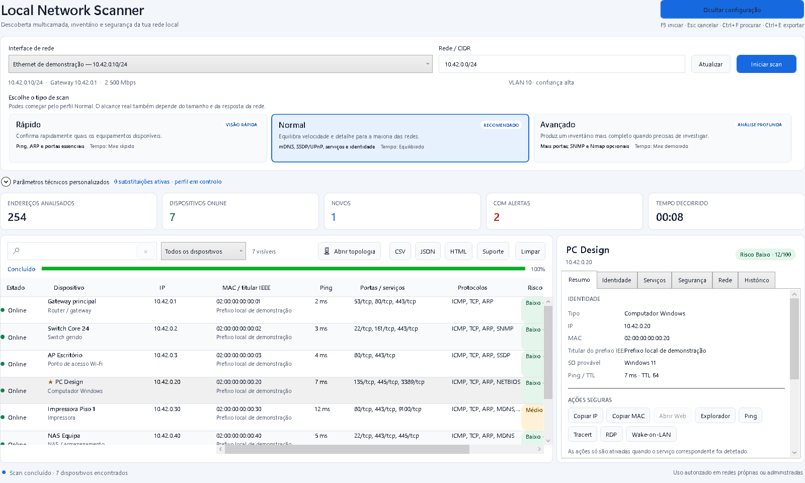
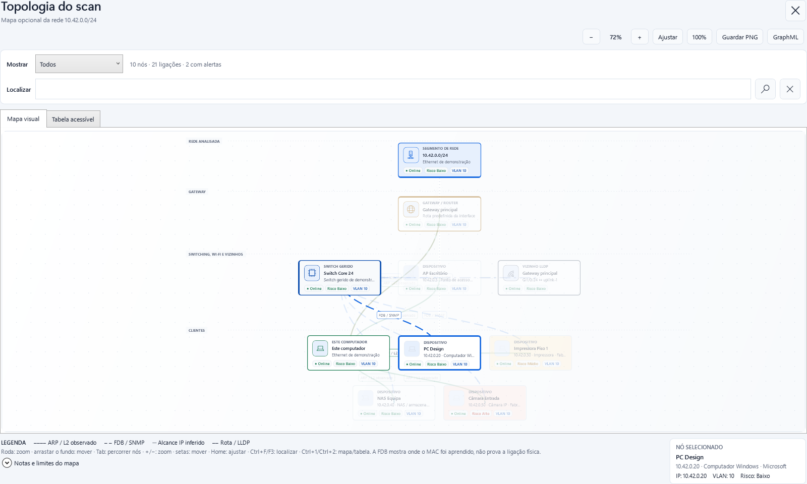

<!-- Copyright (c) 2026 p-darksy-r and Local Network Scanner. Licensed under the MIT License. -->

# Local Network Scanner

[](https://github.com/p-darksy-r/LocalNetworkScanner/tree/v1.3.4)

[](https://github.com/p-darksy-r/LocalNetworkScanner/blob/main/LICENSE)

[CI](https://github.com/p-darksy-r/LocalNetworkScanner/actions/workflows/ci.yml) · [Releases](https://github.com/p-darksy-r/LocalNetworkScanner/releases) · [Instalação](https://github.com/p-darksy-r/LocalNetworkScanner/blob/main/docs/INSTALLATION.md) · [Limites técnicos](https://github.com/p-darksy-r/LocalNetworkScanner/blob/main/docs/TECHNICAL_LIMITS.md)

Scanner de redes locais para Windows com uma UI WPF simples, uma CLI para automação, diagnósticos acionáveis e topologia opcional. O programa separa observações diretas, dados fornecidos pela infraestrutura e inferências, para que um resultado provável nunca seja apresentado como facto confirmado.

> **Estado de distribuição:** a `v1.2.0` é histórica e não é recomendada para instalação porque foi publicada sem Authenticode. A `v1.3.4` identifica o candidato de código e QA mais recente; no repositório privado pode existir como prerelease `Private QA (NotSigned)`, mas não é uma distribuição pública de produção.
>
> O repositório é privado. Uma tag nova executa a QA completa e, enquanto os gates de produção estiverem incompletos, pode criar automaticamente apenas uma prerelease privada `NotSigned`; a distribuição pública só é autorizada depois dos gates de assinatura, validação x64/ARM64 nativa e redistribuição indicados abaixo. Consulte o [guia de assinatura](docs/SIGNING.md).





_Imagens geradas com dados sintéticos; não expõem endereços nem identificadores de uma rede real._

## Escolher o download

Cada release disponibiliza uma versão para computadores x64 e outra para Windows ARM64:

| Formato | Ficheiro | Quando usar |
| --- | --- | --- |
| **Instalador** | `LocalNetworkScanner-<versão>-<arquitetura>-setup.exe` | instalação por utilizador, entrada no menu Iniciar, desinstalador e atalho opcional |
| **Portátil** | `LocalNetworkScanner-<versão>-<arquitetura>.zip` | execução sem instalação; extraia primeiro o ZIP e abra `LocalNetworkScanner.exe` |

Os dois formatos incluem a UI, a CLI e o runtime .NET necessário. O instalador não pede privilégios administrativos no fluxo normal, não instala drivers ou serviços e não altera o `PATH`.

Além dos quatro downloads, a release inclui os checksums individuais e combinado, `SIGNING-STATE.txt`, `VALIDATION-ATTESTATION.json` e o SBOM SPDX 2.2: ao todo, um contrato exato de 12 assets verificáveis.

### Compatibilidade e validação

| Alvo | Estado |
| --- | --- |
| Windows 11 x64 | código 1.3.4: build Release, testes determinísticos e smoke UI/CLI obrigatórios; o workflow da tag instala, executa e remove o pacote self-contained exato antes de o marcar como validado |
| Windows 11 ARM64 | CI e release exigem build, testes e smoke num runner Windows ARM64 nativo; o cross-build isolado deixou de contar como validação |
| Windows 10 | o .NET 10 limita o suporte atual a edições LTSC/Enterprise compatíveis; consulte a [matriz oficial da Microsoft](https://learn.microsoft.com/dotnet/core/install/windows#supported-versions) |

Os executáveis são self-contained, mas não são NativeAOT. Algumas bibliotecas internas podem ser extraídas temporariamente pelo runtime quando a aplicação arranca.

### Aviso de assinatura

Os artefactos históricos da `v1.2.0` e as prereleases privadas de QA `v1.3.x` sem credenciais estão **sem assinatura Authenticode (`NotSigned`)**. O Microsoft Defender SmartScreen pode apresentar um aviso de reputação e o Smart App Control ou uma política empresarial pode bloquear completamente o arranque com o código `4551`. Antes de executar:

1. não use a `v1.2.0` como build de produção; aguarde uma release cujo `SIGNING-STATE.txt` indique `Authenticode: Signed`;
2. compare o SHA-256 com `SHA256SUMS.txt` ou com o ficheiro `.sha256` adjacente;
3. não execute o ficheiro se o hash for diferente.

```powershell
$file = '.\LocalNetworkScanner-<versão>-win-x64.zip'
(Get-FileHash -LiteralPath $file -Algorithm SHA256).Hash.ToLowerInvariant()
```

Um checksum deteta alterações relativamente ao ficheiro publicado, mas não substitui uma assinatura de código. O código `4551` acontece antes de a aplicação arrancar e, por isso, não pode ser corrigido pela própria UI depois do bloqueio. Não desative a proteção: use uma release assinada por um publisher autorizado ou peça ao administrador da rede para avaliar a aplicação. Consulte o [guia específico de Windows App Control](docs/APP_CONTROL.md), o [guia de assinatura](docs/SIGNING.md) e o [guia de instalação](docs/INSTALLATION.md).

## Início rápido

1. Abra `LocalNetworkScanner.exe`.
2. Escolha a interface IPv4 e confirme o intervalo CIDR.
3. Use **Rápido** para uma primeira passagem ou **Normal** para o inventário recomendado e inicie com o ícone de reprodução (`Alt+I`).
4. Analise a lista de dispositivos; abra **Topologia** apenas quando quiser explorar o mapa do mesmo scan. `F5` também inicia o scan, `Alt+C` cancela-o e `Esc` limpa a pesquisa focada ou cancela um scan ativo; na janela da topologia, `Esc` fecha apenas essa janela.

Abrir **Parâmetros técnicos personalizados** apenas mostra os valores. Estes só substituem o perfil depois de ativar explicitamente **Usar definições personalizadas**; o contador indica quantas substituições estão efetivamente ativas.

Comece com um intervalo pequeno e use o perfil **Avançado** apenas quando precisar de mais portas e detalhe. Utilize a aplicação somente numa rede própria ou explicitamente autorizada.

## O que o diferencia

- **Resultados honestos:** cada relação de topologia preserva origem, confiança e evidência.
- **UI acessível e adaptável:** comandos óbvios usam ícones compactos, mas preservam tooltip, nome de automação, navegação por teclado, alvos de 40 px e feedback para leitores de ecrã; a configuração recolhe durante o scan e os painéis ajustam-se ao espaço disponível.
- **Lista primeiro:** o inventário continua a ser a vista principal depois do scan.
- **Topologia a pedido:** o mapa abre numa janela separada sem repetir ou alterar o scan.
- **Diagnósticos pesquisáveis:** códigos `LNS-*` distinguem entrada, rede, dispositivo e falhas internas.
- **Degradação visível:** se o Windows não disponibilizar o baseline ARP, `LNS-NET-011` explica por que a confirmação ARP ficou desativada sem invalidar ICMP/TCP/multicast.
- **Três profundidades:** Rápido, Normal e Avançado para utilizadores com necessidades diferentes.
- **Personalização explícita:** consultar opções técnicas não altera o scan; ativação, contagem e reposição dos valores do perfil permanecem visíveis.
- **Impacto antes de executar:** uma estimativa conservadora agrega endereços, tentativas TCP e probes de serviço, assinala o tráfego adicional do Nmap e reúne os consentimentos aplicáveis num único diálogo antes de uma carga alta ou extrema.
- **Identidade por evidências:** fabricante, modelo, nome, firmware e serial são fundidos com origem e confiança, sem confundir anúncios com factos autenticados.
- **Descoberta multicamada:** ICMP ligado à interface escolhida, TCP, ARP, mDNS/DNS-SD com endpoints SRV, SSDP/UPnP, WS-Discovery, NetBIOS, SNMP opcional e Nmap local opcional.
- **Inventário útil:** IP, hostname, MAC, titular IEEE separado da marca identificada, modelo, latência, portas, serviços, protocolos observados e risco heurístico.
- **Metadados protegidos:** alias, notas e favoritos só são editáveis num resultado que possa ser guardado, não são sobrescritos por uma atualização da mesma linha e iniciar outro scan, limpar resultados ou fechar pede confirmação se existirem alterações por guardar.
- **Dados locais:** histórico, preferências, metadados e o registo técnico limitado de uma falha fatal permanecem no computador.
- **Suporte com privacidade:** a CLI pode gerar um diagnóstico agregado sem identificadores da rede.
- **UI e CLI:** utilização visual para o dia a dia e exportação automatizável para fluxos técnicos.

## Perfis de scan

| Capacidade | Rápido | Normal | Avançado |
| --- | :---: | :---: | :---: |
| ICMP, TCP, ARP e descoberta multicast | Sim | Sim | Sim |
| Portas TCP | essenciais | serviços comuns | `1-1024` e catálogo adicional |
| NetBIOS | Não | Sim | Sim |
| Descrição UPnP segura | Não | Sim | Sim |
| Probes leves e banners | Não | Sim | Sim |
| Identidade SNMP v2c | opt-in | opt-in | opt-in |
| Nmap instalado localmente | Não | Não | opt-in |
| Tolerância de timeout | menor | equilibrada | maior |
| Utilização recomendada | primeira passagem | inventário habitual | diagnóstico autorizado e dirigido |

As opções técnicas da UI só substituem partes do perfil quando **Usar definições personalizadas** está ativado. Abrir ou fechar o painel não muda o comportamento; **Repor valores do perfil** elimina as substituições técnicas. Antes de iniciar, a aplicação calcula uma estimativa de carga: não prevê duração, mas torna explícito o máximo de tentativas nativas por endereços/portas/probes e exige confirmação para níveis altos ou extremos. A identidade SNMP v2c e a topologia SNMP são independentes e permanecem desativadas até o utilizador fornecer explicitamente uma community. A integração Nmap só fica disponível no perfil Avançado, usa um `nmap.exe` instalado separadamente, executa tráfego adicional no seu próprio orçamento e nunca é descarregada ou incluída pelo projeto. Os avisos de carga, SNMP sem cifragem e Nmap são reunidos num único pedido de consentimento.

## Funcionalidades

| Área | Informação apresentada | Origem ou limite principal |
| --- | --- | --- |
| Identidade | IP, hostname, NetBIOS, MAC, titular IEEE, fabricante, modelo, nome anunciado, firmware, serial, serviços/endpoints DNS-SD, fonte e confiança | UPnP, DNS-SD, SNMP e Nmap são evidências não autenticadas ou dependentes da configuração; campos podem ficar desconhecidos ou conflituosos |
| Disponibilidade | latência e métodos de descoberta | ICMP, TCP ou ARP fresco (`Reachable`/resposta direta) confirmam o alvo naquele instante; a cache existente antes do scan só enriquece um alvo já confirmado |
| Portas e serviços | portas TCP abertas, nome provável, resposta leve e estado TLS verificado | uma porta convencional não prova cifragem; não existe autenticação, exploração ou inspeção profunda |
| Protocolos | ICMP, ARP, TCP e protocolos associados às respostas observadas | não é uma captura nem uma contagem de pacotes |
| Equipamento | tipo, sistema operativo provável e risco | classificação heurística, nunca identificação garantida |
| Wi-Fi | SSID, BSSID, canal, rádio e percentagem de sinal local | sinal do computador para o access point, não de cada dispositivo |
| VLAN | configuração exposta pelo adaptador ou evidência inequívoca do switch | não captura tags 802.1Q |
| Camada 2 | alcance direto quando existe evidência ARP ativa | uma entrada passiva em cache não basta e o resultado não confirma o switch físico |
| Histórico | novo, alterado, visto anteriormente, favorito, alias e notas | snapshots locais; MACs aleatórios podem mudar a identidade |
| Ações | copiar dados, abrir endpoints e Wake-on-LAN | execute apenas ações autorizadas e confirme o alvo |
| Exportações | JSON schema v6, CSV UTF-8, HTML, GraphML e relatório de suporte agregado | os relatórios de inventário incluem evidência/serial e endpoints mDNS/DNS-SD quando disponíveis e são sensíveis; o relatório de suporte exclui identificadores |

### Base IEEE incorporada e offline

A aplicação inclui uma snapshot comprimida de MA-L, MA-M, MA-S e IAB: **58 166 linhas oficiais na snapshot de 2026-08-12 e 58 163 prefixos únicos depois da normalização**. A identificação funciona sem Internet e usa correspondência pelo prefixo mais específico, na ordem `/36 → /28 → /24`. O registo CID não é usado como fabricante de MACs globais.

A atualização pela IEEE é opcional e só começa quando o utilizador escolhe **Verificar atualização IEEE**. Não existe telemetria nem envio do inventário durante essa operação. A aplicação apresenta o titular registado do prefixo, não garante o fabricante físico: atribuições `Private`, MACs locais/aleatórios, virtualização, componentes OEM e blocos partilhados podem permanecer desconhecidos ou identificar apenas a interface.

Consulte [Base de entidades MAC](https://github.com/p-darksy-r/LocalNetworkScanner/blob/main/docs/VENDOR_DATABASE.md) para fontes, contagens e limites. Os dados IEEE não são licenciados sob MIT; antes de redistribuir publicamente um binário que inclua a snapshot, obtenha autorização escrita da IEEE e consulte [THIRD_PARTY_NOTICES.md](https://github.com/p-darksy-r/LocalNetworkScanner/blob/main/THIRD_PARTY_NOTICES.md).

## Topologia opcional

O scan termina sempre na lista de dispositivos. Quando existe um mapa, o botão com ícone **Abrir topologia** abre uma janela própria; os comandos por ícone mantêm nomes acessíveis e tooltips, e `Esc` fecha a janela sem alterar o inventário. A topologia inclui:

- zoom com botões e percentagem visíveis, pan, enquadramento automático e vista a 100%;
- seleção sincronizada com o inventário;
- tabela alternativa para teclado, leitores de ecrã e consulta exata da evidência;
- filtros de infraestrutura, clientes e alertas que preservam o caminho de contexto até ao nó correspondente;
- distinção visual entre relações observadas, fornecidas e inferidas;
- exportação PNG e GraphML;
- enriquecimento LLDP quando um switch autorizado o disponibiliza.

A integração de topologia SNMP v2c é opt-in e consulta somente o switch gerido indicado pelo utilizador. Pode recolher identidade do switch, FDB Bridge/Q-BRIDGE, porta/interface, mapeamento VLAN→FDB, PVID e vizinhos LLDP. Uma opção separada pode consultar MIB-II/ENTITY-MIB nos dispositivos encontrados para obter fabricante, modelo, revisões e serial; não tenta communities e não guarda a community fornecida.

Uma entrada FDB confirma apenas que a bridge aprendeu o MAC. Não prova ligação física direta: a porta pode ser de acesso, uplink, trunk, access point, stack ou bridge remota. Observações ambíguas são preservadas em vez de serem reduzidas a uma conclusão falsa. SNMPv3, descoberta automática de switches e topologias multi-switch ainda não são suportados.

Leia os [limites técnicos completos](https://github.com/p-darksy-r/LocalNetworkScanner/blob/main/docs/TECHNICAL_LIMITS.md) antes de interpretar ou partilhar o mapa.

## Diagnósticos e códigos de erro

Um diagnóstico inclui código, categoria, severidade, mensagem em pt-PT, ação recomendada e contexto sanitizado:

| Prefixo | Origem provável |
| --- | --- |
| `LNS-USR-*` | opção, intervalo ou configuração que o utilizador pode corrigir |
| `LNS-NET-*` | interface, conectividade, firewall ou política da rede |
| `LNS-DEV-*` | resposta ou identidade inválida/desconhecida de um dispositivo |
| `LNS-APP-*` | ficheiro, acesso ou falha inesperada da aplicação |

Um aviso de fabricante ou dispositivo desconhecido não significa que o scan falhou. O catálogo público documenta 32 códigos da aplicação/scan, 10 códigos de release e os exit codes da CLI: [Códigos de erro e diagnóstico](https://github.com/p-darksy-r/LocalNetworkScanner/blob/main/docs/ERROR_CODES.md).

Ao pedir suporte, partilhe o código, a versão, a arquitetura e passos mínimos de reprodução. A CLI pode criar um relatório agregado concebido para esse fim:

```powershell
LocalNetworkScanner.Cli.exe scan --cidr 192.168.1.0/24 --support .\support.json
```

Esse relatório omite IPs, MACs, nomes de interface/host/switch, SSIDs, aliases, notas, alvos e contexto bruto dos diagnósticos. Inclui apenas versão/ambiente, contagens, capacidades e códigos agregados. Reveja ainda assim o ficheiro antes de o partilhar; relatórios JSON/CSV/HTML/GraphML normais continuam a conter o inventário completo.

Uma falha fatal da UI cria, quando possível, um registo técnico local em `%LOCALAPPDATA%\LocalNetworkScanner\logs\app.log`. O ficheiro é limitado a 512 KiB, roda para `app.previous.log` e exclui mensagens da exceção, argumentos, alvo/contexto do diagnóstico, credenciais e identificadores de rede. Partilhe-o apenas depois de o rever; o encerramento fatal não tenta voltar a guardar preferências num estado potencialmente inconsistente.

## Privacidade e utilização responsável

O projeto não envia o inventário nem telemetria para um serviço do Local Network Scanner. Um scan comunica diretamente com a rede escolhida; a atualização opcional das listagens IEEE e os links externos são ações explícitas. A atualização não envia MACs, IPs, inventário, SSID ou topologia.

O histórico é guardado em:

```text
%LOCALAPPDATA%\LocalNetworkScanner\snapshots
```

Preferências, metadados, o registo técnico rotativo de uma falha fatal e uma atualização opcional da base IEEE também ficam sob `%LOCALAPPDATA%\LocalNetworkScanner`. A versão portátil usa a mesma localização: “portátil” descreve a distribuição sem instalador, não um modo sem dados locais.

JSON, CSV, HTML, GraphML e snapshots podem revelar IPs, MACs, hostnames, fabricante/modelo, firmware, serial, portas, serviços, SSIDs e topologia. Guarde-os com controlo de acesso e não os anexe diretamente a uma issue pública.

SNMP v2c não cifra a community. Use-o apenas numa rede de gestão confiável, com autorização, e nunca coloque credenciais em argumentos partilhados, logs, screenshots, relatórios ou no repositório.

O enriquecimento Nmap é explicitamente opt-in, limitado a IPv4 privado e TCP Connect/version-light, sem NSE, deteção de SO privilegiada ou raw sockets. A autodeteção procura apenas instalações locais em `Program Files`; não executa entradas do `PATH`, caminhos UNC ou device paths. Um caminho explícito é validado como `nmap.exe` local existente e mostrado antes da confirmação. Produtos de serviço, como OpenSSH ou IIS, permanecem banners/resumos e nunca são promovidos a modelo físico. O projeto não instala nem redistribui Nmap/Npcap; isso evita introduzir drivers, elevação e obrigações de redistribuição sem uma licença OEM adequada.

## Limitações importantes

- Não existe captura de pacotes, inspeção profunda de tráfego ou exploração de serviços.
- Um equipamento pode bloquear ICMP e continuar acessível por TCP, ARP ou multicast.
- O sinal Wi-Fi pertence à ligação local do computador, não aos clientes remotos.
- A VLAN pode vir do adaptador local ou de dados inequívocos do switch; não é descoberta universal por dispositivo.
- Só uma observação ARP posterior ao baseline e ainda marcada `Reachable`, ou uma resposta ARP direta sem entrada prévia, sustenta a inferência de segmento L2; uma entrada anterior na cache não torna um host online, não é eliminada e não identifica o switch físico.
- O titular IEEE do prefixo, o fabricante físico, o tipo de equipamento, o sistema operativo e o risco não são identificações garantidas.
- Multicast pode ser bloqueado por firewall, isolamento Wi-Fi, VLANs ou políticas da rede. SSDP, WS-Discovery e mDNS repetem transmissões iniciais dentro de um orçamento comum e limitado, mas não garantem resposta; um endereço apenas anunciado dentro de mDNS não cria um dispositivo online sem evidência direta do remetente.
- SSDP/UPnP, mDNS/DNS-SD, WS-Discovery, SNMP e os banners Nmap são declarações do equipamento e podem ser incompletos, antigos ou forjados; a UI preserva origem, confiança e conflitos.
- Nenhuma combinação de protocolos garante marca/modelo para todos os dispositivos: muitos não publicam metadados, usam MAC local, bloqueiam gestão ou ficam atrás de routers/APs.
- Os resultados são um retrato temporal, não monitorização contínua.
- O suporte ARM64 só é considerado validado quando o job nativo `windows-11-arm` conclui build, testes e smoke; um cross-build local isolado não satisfaz esse gate.
- Builds locais e artefactos privados de QA podem estar `NotSigned`; uma GitHub Release pública é recusada até todos os executáveis terem Authenticode confiável e timestamp válido.

## CLI

Listar interfaces:

```powershell
LocalNetworkScanner.Cli.exe interfaces
```

Executar um scan e exportar todos os formatos:

```powershell
LocalNetworkScanner.Cli.exe scan `
  --interface 1 `
  --cidr 192.168.1.0/24 `
  --profile standard `
  --json .\report.json `
  --csv .\report.csv `
  --html .\report.html `
  --graphml .\topology.graphml `
  --support .\support.json
```

Enriquecimento opcional no perfil Avançado:

```powershell
$env:LNS_SNMP_COMMUNITY = '<community-temporária>'
LocalNetworkScanner.Cli.exe scan --profile advanced --snmp-identity --nmap
Remove-Item Env:LNS_SNMP_COMMUNITY
```

A variável de ambiente evita expor a community nos argumentos do processo. Ainda assim, SNMP v2c transmite-a sem cifragem na rede. `--nmap-path C:\Ferramentas\Nmap\nmap.exe` substitui a autodeteção; o caminho tem de ser local e a aplicação valida primeiro `nmap --version`.

Perfis aceites: `quick`, `standard` e `advanced`; `deep` continua disponível como alias histórico. A especificação de portas aceita listas, intervalos e os aliases `quick`, `top`, `deep` e `all`.

```powershell
LocalNetworkScanner.Cli.exe --help
```

Exit codes:

| Código | Resultado |
| --- | --- |
| `0` | concluído; pode conter avisos não fatais |
| `1` | falha da aplicação |
| `2` | entrada/configuração inválida |
| `3` | falha de rede |
| `4` | falha associada a dispositivo/dados |
| `130` | operação cancelada |

## Desenvolvimento

Requisitos:

- Windows 11, ou uma edição Windows suportada pela matriz atual do .NET 10;
- .NET SDK `10.0.301` ou patch compatível permitido por `global.json`;
- PowerShell 5.1 ou PowerShell 7;
- uma interface IPv4 ativa apenas para testes reais opt-in.

Validação completa:

```powershell
powershell -ExecutionPolicy Bypass -File .\scripts\check.ps1 -Configuration Release -VerifyFormat
```

O gate verifica copyright, restore, build com warnings como erros, uma suite determinística com contagem validada, formatação e smoke da CLI. Na `v1.3.4`, a suite contém 89 testes. Os testes automáticos usam loopback e dados sintéticos; scans reais não pertencem ao CI.

O workflow CodeQL analisa C# com consultas `security-extended` quando o repositório é público ou quando `CODEQL_ENABLED=true` e o plano privado permite code scanning. A release restaura metadados de dependências para `win-x64` e `win-arm64`, exige ambos os runtimes e gera/valida um SBOM SPDX 2.2 como evidência separada, sem o confundir com os dez ficheiros instaláveis validados.

Executar a UI:

```powershell
dotnet run --project .\LocalNetworkScanner.Wpf\LocalNetworkScanner.Wpf.csproj
```

Executar a CLI durante o desenvolvimento:

```powershell
dotnet run --project .\LocalNetworkScanner.Cli\LocalNetworkScanner.Cli.csproj -- --help
```

Consulte o [guia de contribuição](https://github.com/p-darksy-r/LocalNetworkScanner/blob/main/CONTRIBUTING.md) e a [política de copyright](https://github.com/p-darksy-r/LocalNetworkScanner/blob/main/docs/COPYRIGHT_POLICY.md) antes de alterar o projeto.

## Publicar para Windows

Pacotes portáteis self-contained:

```powershell
powershell -ExecutionPolicy Bypass -File .\scripts\publish-windows.ps1 -RuntimeIdentifier win-x64
powershell -ExecutionPolicy Bypass -File .\scripts\publish-windows.ps1 -RuntimeIdentifier win-arm64
```

Instalador Inno Setup:

```powershell
powershell -ExecutionPolicy Bypass -File .\scripts\build-installer.ps1 -RuntimeIdentifier win-x64
```

Uma tag existente `vX.Y.Z` que corresponda à versão em `Directory.Build.props` inicia a QA dos pacotes; o workflow recusa pedidos executados apenas sobre um branch. A publicação de produção continua a exigir `workflow_dispatch` explícito nessa tag com `publish_release=true`. Antes do build, o preflight confirma que tags lightweight ou anotadas resolvem para o HEAD atual de `main` e apresenta códigos `LNS-REL-*` para configurações ou autorizações ausentes. A assinatura pública usa Microsoft Artifact Signing por OIDC: a chave permanece num HSM/serviço e não existe PFX no GitHub.

Os dez ficheiros candidatos são carregados uma única vez numa **GitHub draft release privada**, identificada pelo repositório, run, tentativa, commit, tag, digest canónico e nonce. Não é criado qualquer artefacto de GitHub Actions, eliminando a duplicação pesada e a falha por quota. Os runners Windows x64 e ARM64 descarregam cada asset autenticado pelo respetivo ID e confirmam nome, estado, tamanho e SHA-256. Só depois dos dois testes nativos o gate aceita a evidência Base64 limitada a 64 KiB, valida tamanho, hash, UTF-8, JSON e proveniência, troca exclusivamente o `SIGNING-STATE.txt` de `Pending` para `Validated` e adiciona `VALIDATION-ATTESTATION.json` e o SBOM SPDX 2.2. O contrato final tem **12 assets permanentes**. Imediatamente antes de publicar, o workflow volta a validar tag, visibilidade, ownership e todos os digests; numa falha, apaga apenas a draft que pertence à própria tentativa. Uma execução idempotente aceita uma release já publicada somente depois de verificar o contrato remoto e a tentativa histórica de validação. Resultados `NotSigned` só podem tornar-se uma prerelease `Private QA` enquanto a API confirmar que o repositório continua privado; a distribuição pública exige Authenticode confiável e autorização IEEE. Consulte [Windows App Control e erro 4551](docs/APP_CONTROL.md).

A [checklist de release](https://github.com/p-darksy-r/LocalNetworkScanner/blob/main/docs/RELEASE_CHECKLIST.md) exige validação num Windows limpo, estado de assinatura explícito, verificação pós-upload e teste nativo por arquitetura antes de considerar o suporte totalmente validado. O [guia de assinatura](docs/SIGNING.md) explica exatamente o que o projeto automatiza e o que exige uma identidade externa do publisher.

## Estrutura do projeto

```text
LocalNetworkScanner.Core/   descoberta, modelos, análise e exportação
LocalNetworkScanner.Cli/    interface de linha de comandos
LocalNetworkScanner.Wpf/    aplicação gráfica Windows
LocalNetworkScanner.Tests/  harness determinístico e smoke WPF
.github/                    CI, release, propriedade e templates
docs/                       instalação, diagnósticos e limites técnicos
installer/                  instalador por utilizador com Inno Setup
scripts/                    validação, publish e empacotamento
```

## Suporte, segurança e licença

- Problemas reproduzíveis: [GitHub Issues](https://github.com/p-darksy-r/LocalNetworkScanner/issues)
- Vulnerabilidades exploráveis: [Security Advisory privado](https://github.com/p-darksy-r/LocalNetworkScanner/security/advisories/new)
- Política de segurança: [SECURITY.md](https://github.com/p-darksy-r/LocalNetworkScanner/blob/main/SECURITY.md)
- Changelog: [CHANGELOG.md](https://github.com/p-darksy-r/LocalNetworkScanner/blob/main/CHANGELOG.md)
- Código e assets originais: [MIT](https://github.com/p-darksy-r/LocalNetworkScanner/blob/main/LICENSE)
- Dados e materiais de terceiros: [THIRD_PARTY_NOTICES.md](https://github.com/p-darksy-r/LocalNetworkScanner/blob/main/THIRD_PARTY_NOTICES.md)

A licença MIT não abrange nem relicencia a snapshot da IEEE Registration Authority. A presença desses dados não implica certificação, patrocínio ou endorsement pela IEEE.

<!-- Copyright (c) 2026 p-darksy-r and Local Network Scanner. Licensed under the MIT License. -->
